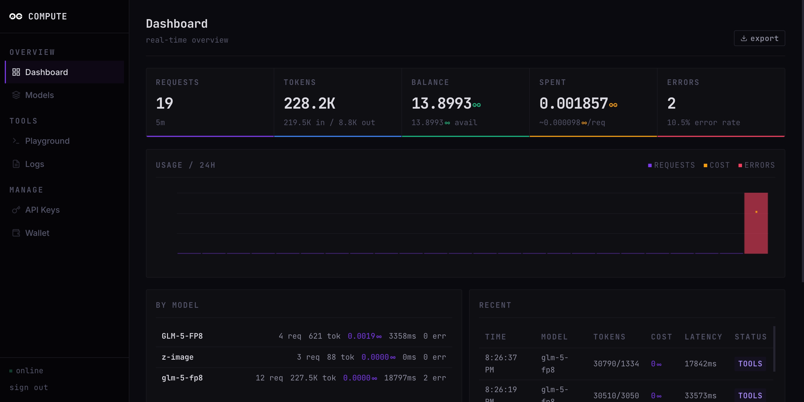
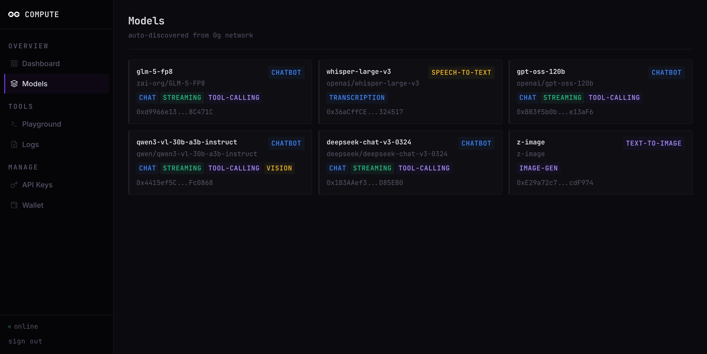
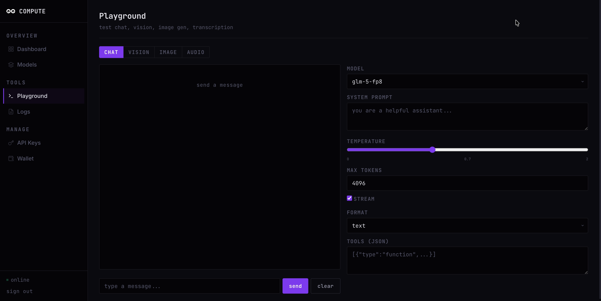
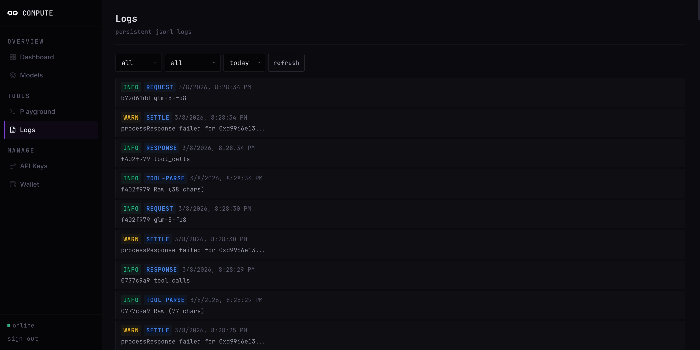

<p align="center">
  <a href="https://0g.ai">
    
  </a>
</p>

<h1 align="center">0G Compute Adapter for OpenClaw</h1>

<p align="center">
  <strong>Run OpenClaw on decentralized AI inference via the 0G Compute Network</strong>
</p>

<p align="center">
  An OpenAI-compatible proxy that lets <a href="https://openclaw.ai">OpenClaw</a> talk to models on the <a href="https://0g.ai">0G Network</a>. Works with both small and large models, with or without media support. Based on the <a href="https://github.com/claraverse-space/0G-Compute-Adapter">0G Compute Adapter</a> by <a href="https://github.com/claraverse-space"><strong>@claraverse-space</strong></a>, with improvements for OpenClaw compatibility.
</p>

<p align="center">
  
  
  
</p>

---

## How It Works

OpenClaw needs an OpenAI-compatible API to talk to. The 0G network provides cheap decentralized inference but doesn't speak the full OpenAI protocol. This adapter sits in between:

```
OpenClaw  -->  0G Compute Adapter (localhost:8000)  -->  0G Network (decentralized GPU providers)
```

The adapter runs as a persistent server that constantly listens for requests from OpenClaw. When OpenClaw sends a prompt, the adapter fires it on the 0G Compute Network and returns the response.

## Setup

There are two parts: setting up the adapter, then connecting OpenClaw to it.

### Part 1: 0G Compute Adapter

#### Prerequisites

- **Node.js 18+**
- **Ethereum wallet** with 0G tokens (testnet or mainnet)

#### Install

```bash
git clone https://github.com/mandatedisrael/0G-Compute-Adapter.git
cd 0G-Compute-Adapter
npm install
```

#### Configure

Create a `.env` file in the project root:

```env
OG_PRIVATE_KEY=0x_your_private_key_here
```

> **Note:** The adapter is built for **mainnet** by default. If you are testing with testnet, change the RPC URL in `server.js`:
> ```js
> // Mainnet (default):
> // const RPC_URL = process.env.OG_RPC_URL || 'https://evmrpc.0g.ai';
>
> // Testnet:
> const RPC_URL = process.env.OG_RPC_URL || 'https://evmrpc-testnet.0g.ai';
> ```
> Or set it in your `.env`:
> ```env
> OG_RPC_URL=https://evmrpc-testnet.0g.ai
> ```

#### Start

```bash
npm start
```

You should see output like:

```
Wallet: 0x...
Discovering models...
Discovered 4 models:
  qwen-2.5-7b-instruct (chatbot) -> 0xa48f0128...

0G OpenAI Proxy running on http://localhost:8000

API Keys:
  sk-0g-xxxxxxxxxxxxxxxxxxxxxxxxxxxxxxxx (default)
```

**Save that API key** (starts with `sk-`) -- you'll need it for OpenClaw.

The adapter is now listening and waiting for requests. Keep this terminal running.

### Part 2: OpenClaw

#### Install and Onboard

Install OpenClaw and run the onboarding:

```bash
openclaw onboard
```

Select **Quickstart** when prompted -- it handles ports, gateway, and other settings so you don't have to configure everything manually.

#### Connect to 0G

When configuring the model provider:

| Setting | Value |
|---|---|
| **Provider type** | Custom provider |
| **API base URL** | `http://localhost:8000/v1` |
| **API key** | The `sk-0g-...` key from the adapter startup output |
| **Endpoint compatibility** | OpenAI |
| **Model ID** | The model name from 0G, e.g. `qwen/qwen-2.5-7b-instruct` |
| **Endpoint ID** | Use default |
| **Model alias** | Whatever you prefer (e.g. `qwen`, `deepseek`) |

Every other setting is not 0G-specific and depends on your preference.

#### Start OpenClaw

```bash
openclaw gateway
```

OpenClaw will now route requests through the adapter to the 0G network.

## Dashboard

The adapter comes with a built-in admin dashboard at `http://localhost:8000`. Log in with your API key or admin key.

<p align="center">
  
</p>

**Models** — Browse all auto-discovered models from the 0G network

<p align="center">
  
</p>

**Playground** — Test any model directly with streaming, tool calling, and vision

<p align="center">
  
</p>

**Logs** — Searchable persistent logs with level and category filters

<p align="center">
  
</p>

> Dashboard built by [@claraverse-space](https://github.com/claraverse-space) as part of the original [0G Compute Adapter](https://github.com/claraverse-space/0G-Compute-Adapter).

## Available Models

Models are auto-discovered from the 0G network and refreshed every 5 minutes. Unreachable providers are automatically skipped.

Run the adapter and check `http://localhost:8000/v1/models` to see what's currently available, or visit the dashboard at `http://localhost:8000`.

## Features

- **Full OpenAI compatibility** -- `/v1/chat/completions`, `/v1/models`, streaming, tool calling, structured output
- **Provider health-checking** -- automatically skips unreachable providers on the network
- **Content normalization** -- automatically flattens text-only content arrays for providers that don't support OpenAI's multimodal format, while preserving media (images/audio/video) when present
- **Admin dashboard** -- real-time stats, model browser, playground, logs at `http://localhost:8000`
- **API key management** -- multi-key auth with per-key rate limiting
- **Auto-discovery** -- models refresh from the network every 5 minutes

## Configuration

| Variable | Required | Default | Description |
|---|---|---|---|
| `OG_PRIVATE_KEY` | **Yes** | -- | Ethereum private key with 0G tokens |
| `OG_RPC_URL` | No | `https://evmrpc.0g.ai` | RPC endpoint (change for testnet) |
| `OG_API_KEYS` | No | Auto-generated | Comma-separated client API keys |
| `OG_ADMIN_KEY` | No | Auto-generated | Admin key for dashboard |
| `OG_RATE_LIMIT` | No | `60` | Max requests per minute per API key |
| `PORT` | No | `8000` | Server port |

## Credits

- **[0G Compute Adapter](https://github.com/claraverse-space/0G-Compute-Adapter)** by [@claraverse-space](https://github.com/claraverse-space) -- the original adapter that makes this possible
- **[0G Network](https://0g.ai)** -- decentralized AI compute infrastructure
- **[OpenClaw](https://openclaw.ai)** -- open agent platform

## License

MIT License. See [LICENSE](LICENSE).
